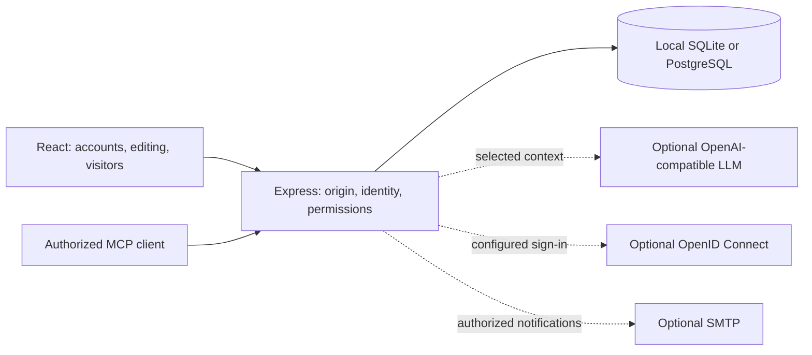

# MeetLoom architecture

One Node.js 24 application serves the Express API and the React frontend built by Vite. SQLite supports local startup without another service; PostgreSQL is the target for durable deployments. The distributed configuration uses one application pod. Session data does not require an external cloud service.

## Modules

| Domain                 | Location                                                      | Responsibility                                                                                      |
| ---------------------- | ------------------------------------------------------------- | --------------------------------------------------------------------------------------------------- |
| Model and domain logic | `shared/`                                                     | Block trees, scheduling, timer, validation, merging, public projection, rich documents, and content |
| API assembly           | `server/app.ts`                                               | Identity, effective authorization, sessions, and transactional writes with version checks           |
| Storage                | `server/db.ts`                                                | Shared parameterized SQL, PostgreSQL transactions, SQLite serialization, startup schema lock        |
| Protection             | `security.ts`, `quotas.ts`, `audit.ts`                        | Hashing, rate limits and request budgets, public-link storage quotas, administrator audit trail     |
| Accounts and services  | `accounts.ts`, `oidc.ts`, `mailer.ts`                         | Profiles, recovery, revocation, organizational sign-in, and optional messages                       |
| Operations             | `operations.ts`, `version.ts`                                 | Installed version, and sessions in progress an update could disturb (administrators)                |
| Organization           | `workspaces.ts`, `folders.ts`, `activity.ts`                  | Members and guests, settings, persistent folders, and read markers                                  |
| Collaboration          | `participants.ts`, `comments.ts`, `presence.ts`, `sharing.ts` | Invitations, mentions, internal/public discussions, and scoped links                                |
| History and lifecycle  | `history.ts`, `lifecycle.ts`                                  | Versions, activity log, deleted items, closure, and session trash                                   |
| Content and transfers  | `content-api.ts`, `transfers.ts`                              | Pages, forms/responses, and atomic transfers between agendas                                        |
| AI and imports         | `ai*.ts`, `document-*.ts`                                     | Explicit context, validated structured responses, and bounded temporary extraction                  |
| Frontend               | `src/`                                                        | Dashboard, editor, public views, and panels loaded for each workflow                                |
| Deployment             | `Dockerfile`, `k8s/`, `scripts/`                              | Rootless image, generic resources, and operator-managed installation                                |

## Documents, permissions, and transactions

An agenda is a versioned JSON document. Its objects have stable identifiers; validation bounds sizes, depth, and references. Saving increments the version only when the previous version matches. History, mentions, and the folder registry participate in the same transaction. Copying or moving between agendas regenerates the necessary identifiers and preserves imported field privacy.

Workspace membership and lifecycle are stored separately. `workspaceId` and `lifecycle` are added to responses from those tables, removed from persistent JSON, and excluded from fields writable by the browser. Effective permissions combine ownership, explicit collaboration, and workspace roles. Owners retain their rights; workspace guests do not gain access to other sessions in that workspace.

Related writes lock the session row before checking closure/deletion. This prevents a form response or comment from being accepted after a concurrent closure. Session, invitation, recovery, sharing, and MCP tokens must never be logged; their storage follows dedicated hashing and expiration mechanisms.

## Trust boundaries

A public projection is explicitly constructed on the server. It excludes team columns, internal comments, versions, and organizational data. Links can restrict permitted content. Participant exports also use a projection before serialization; team exports require explicit action.

Rich text is a validated JSON tree rendered through an allowlist of React components and safe attributes. Import is not attachment storage: content size and processing time are bounded, and unsafe archives and XML are rejected. AI receives the selected context through a configured server endpoint; its output becomes a validated proposal, never an unrestricted privileged mutation.

OIDC and SMTP appear in user workflows only when configured. Tests use local mock adapters; interoperability with an installation's actual services is a separate validation step.

## Retention and operations

Deleted items are recoverable for 72 hours; sessions in the trash for 30 days. Automatic and named versions have separate limits, and cleanup work is bounded. See the [workspace and recovery guide](docs/workspaces-and-lifecycle.md) for exact rules and [operations](docs/operations.md) for backups.

CI runs API contracts against SQLite and PostgreSQL, builds both parts, and checks manifests. The release workflow rebuilds the selected commit, runs a smoke test with an arbitrary UID and read-only root filesystem, scans the image, and then publishes to Docker Hub. Operators update the cluster separately; GitHub has no cluster credentials.
